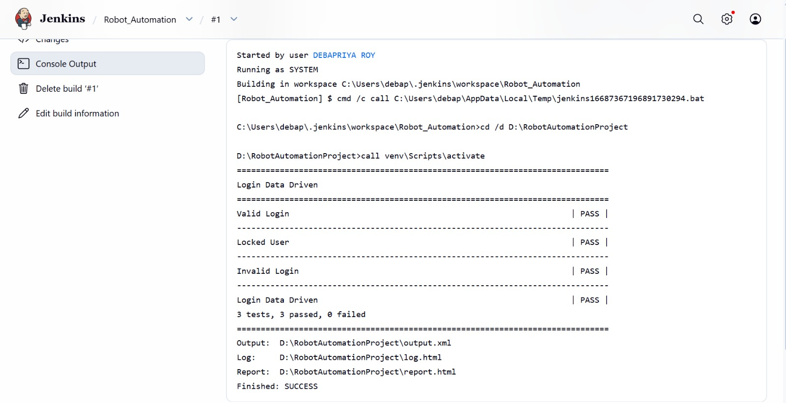
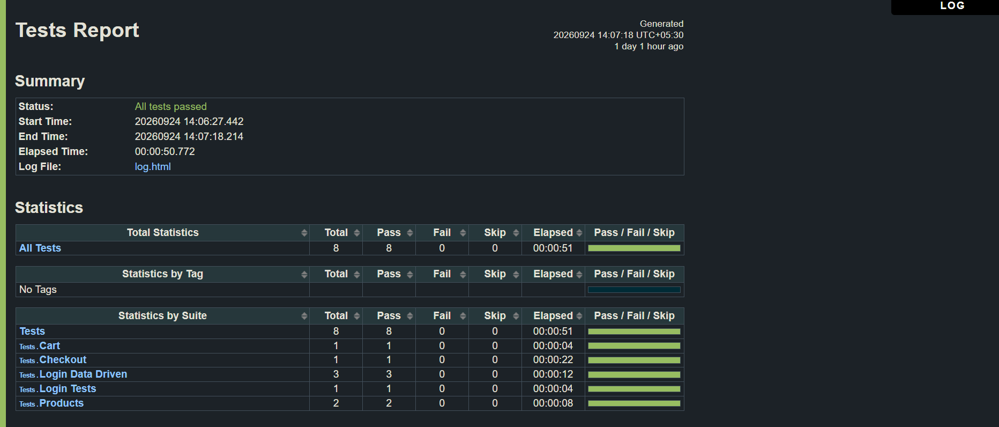
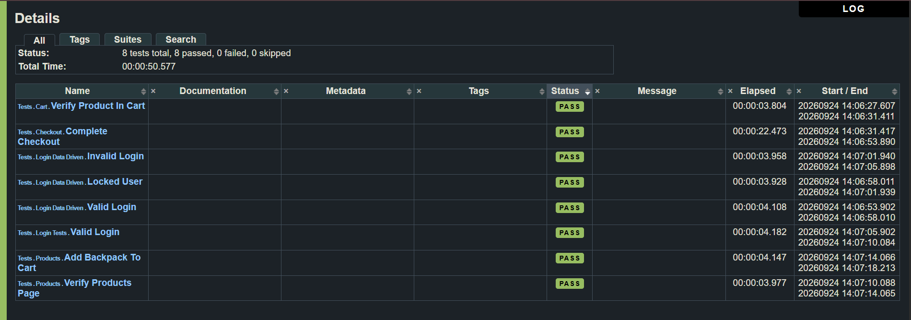

# Capstone Assignment 4: Robot Framework Web Automation Project

## 📺 Project Demonstration Video
Click the link below to watch the live automation execution and Jenkins pipeline run:
Watch the Project Demo Video Here
https://drive.google.com/drive/folders/1NfRmQ0zCVDjezWVHRs6l3isHLo5xulP-?usp=sharing

## Project Overview
This project delivers a complete, production-grade automated testing solution for an E-Commerce web application utilizing the **Robot Framework** ecosystem. The framework is architected using the **Page Object Model (POM)** pattern, utilizing modular resource files, keyword-driven workflows, and external data tables to achieve high maintenance flexibility and reusability. 

Continuous Integration is established via **Jenkins**, featuring interactive graphical performance logs and automated HTML test reports.

---

## Tech Stack & Prerequisites
* **Language:** Python 3.11+ / OpenJDK 25 (LTS)
* **Framework:** Robot Framework, SeleniumLibrary
* **IDE / Editors:** Robot Framework IDE (RIDE), Visual Studio Code
* **CI/CD Platform:** Jenkins CI Server

---

## Project Architecture (Page Object Model)
The repository enforces a strict separation of concerns between test scripts, business logic, and UI elements:

```text
D/:RobotAutomationProject/
│
├── venv/
│
├── tests/
│   ├── login_tests.robot
│   ├── login_data_driven.robot
│   ├── products_tests.robot
│   ├── cart_tests.robot
│   └── checkout_tests.robot
│
├── resources/
│   ├── common.resource
│   ├── variables.resource
│   │
│   └── keywords/
│       ├── login_keywords.resource
│       ├── products_keywords.resource
│       ├── cart_keywords.resource
│       └── checkout_keywords.resource
│
├── pages/
│   ├── login_page.resource
│   ├── products_page.resource
│   ├── cart_page.resource
│   └── checkout_page.resource
│
├── data/
│   └── login_data.csv
│
├── results/
│
├── first_test.robot
├── requirements.txt
└── README.md
```

---

##  Automated Business Flow
The underlying suites programmatically orchestrate the following workflow pipeline:
1. **Launch Browser / Task Setup:** Initializes target driver context via `Open Application`.
2. **Login Profile Validation:** Processes explicit parameters downstream.
3. **Product Lookup:** Queries database inventories sequentially.
4. **Cart Aggregation:** Interacts with cart UI models.
5. **Assertion / Verification:** Validates matching values against active layout nodes.
6. **Logout / Task Teardown:** Terminates secure contexts and performs clean environment exits via `Close Application`.

---

##  Execution Guide

### 1. Manual Execution via Local Command Line
To manually execute the complete data-driven test suite with environment context, open your terminal context and execute:

```powershell
cd /d D:\RobotAutomationProject
source venv/Scripts/activate
robot --outputdir results tests/login_data_driven.robot
```

### 2. Automated Execution Configuration via Jenkins CI
To run the automated regression pipeline inside your Jenkins environment:

1. **Create Job:** Create a new **Freestyle Project** named `Robot_Automation`.
2. **Configure Build Steps:** Add a new *Execute Windows batch command* build step containing the following target instructions:
   ```cmd
   cd /d D:\RobotAutomationProject
   call venv\Scripts\activate
   robot --nostatusrc --outputdir results tests\login_data_driven.robot
   ```


3. **Configure Reporting UI:** Add the *Publish Robot Framework test results* post-build action. Explicitly map the targeted artifact path:
   ```text
   D:\RobotAutomationProject\results
   ```

---

##  Evaluation & Reporting Features

### Handling Strict Jenkins Content Security Policies (CSP)
By default, Jenkins restricts the execution of integrated JavaScript components embedded inside standalone automation reports, resulting in a blank or unstyled warning layout. To permit complete execution of the rich HTML reports, navigate to **Dashboard ➔ Manage Jenkins ➔ Script Console** and apply the following override:

```groovy
System.setProperty("hudson.model.DirectoryBrowserSupport.CSP", "")
```



### Behavior Matrix Under Assertions & Failures
* **Successful Build:** When all internal test steps and loops evaluate to a matching state, the pipeline registers a **Blue/Green (Success)** badge indicator.
* **Intended Failure Behavior:** When an explicit asset locator or data row value changes or fails verification (e.g. searching for a broken item identifier), the pipeline executes to the end due to the active `--nostatusrc` command flag. The overall pipeline will flag a **Yellow (Unstable)** state. This allows Jenkins to successfully capture the output metadata, render the failed statistics inside the active **Robot Results Trend Graph**, and highlight the broken test nodes in red for rapid debugging.
